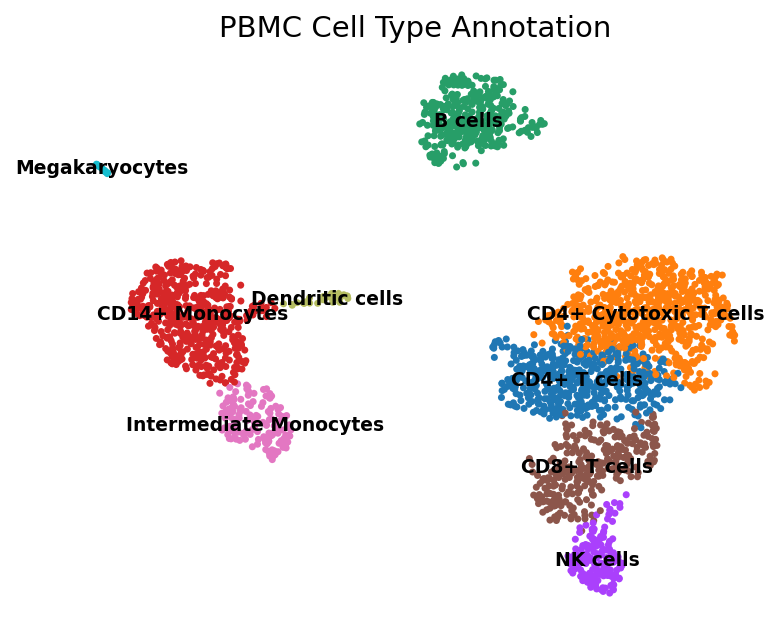
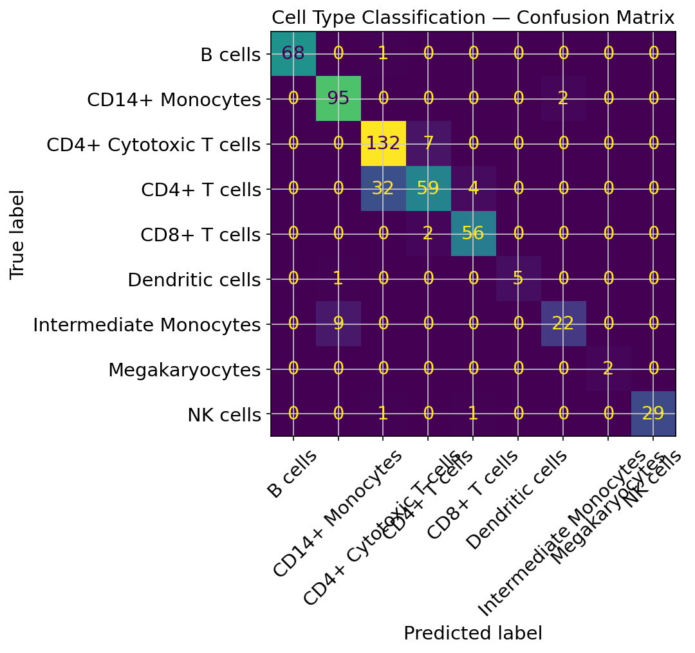
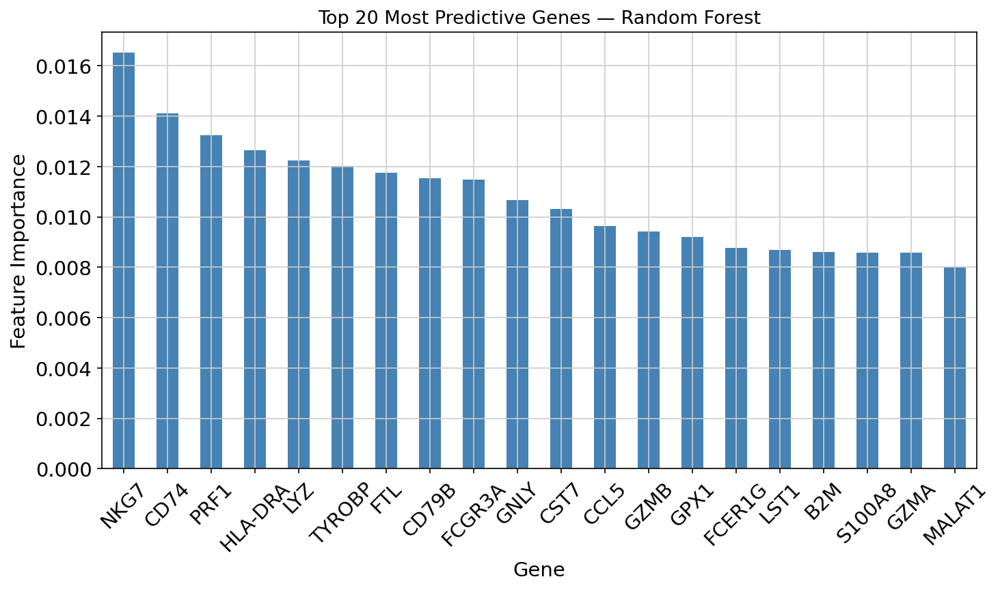

# scRNA-seq Cell Type Classification: 3k PBMC Dataset

**Tools:** Python · Scanpy · scikit-learn · UMAP · Leiden  
**Data:** 10x Genomics 3k PBMCs from a Healthy Donor (freely available)  
**Result:** 9 immune cell populations identified · 89% classification accuracy · 0.90 macro F1

---

## Overview

This project implements a complete single-cell RNA sequencing (scRNA-seq) analysis pipeline on peripheral blood mononuclear cells (PBMCs), from raw count matrices through unsupervised clustering, manual cell type annotation, and supervised machine learning classification.

The goal was to identify distinct immune cell populations from gene expression data alone — with no prior labels — and then train a classifier to predict cell identity from transcriptional profiles.

This type of analysis is directly relevant to large-scale genomics initiatives like the [IGVF Consortium](https://igvf.org/), which maps regulatory element and gene activity at single-cell resolution across hundreds of cell types.

---

## Pipeline

```
Raw counts (MTX)
      ↓
Quality Control          ← filter low-quality cells & rarely-detected genes
      ↓
Normalization            ← library-size correction + log1p transform
      ↓
Feature Selection        ← 2,000 highly variable genes (Seurat v3 method)
      ↓
PCA                      ← 50 components → elbow at PC 10
      ↓
Neighborhood Graph       ← k=10 neighbors in PCA space
      ↓
UMAP                     ← 2D embedding for visualization
      ↓
Leiden Clustering        ← graph-based community detection (resolution=0.5)
      ↓
Marker Gene Analysis     ← Wilcoxon rank-sum test per cluster
      ↓
Cell Type Annotation     ← manual annotation from canonical marker genes
      ↓
RF Classification        ← Random Forest trained on annotated cells
```

---

## Results

### Cell Type Annotation

9 distinct immune populations were identified from 2,638 cells:

| Cluster | Cell Type | Key Markers |
|---|---|---|
| 0 | CD4+ T cells | CD4, IL7R, CCR7 |
| 1 | CD4+ Cytotoxic T cells | CD4 (dominant), CD8A/B (minor) |
| 2 | B cells | MS4A1, CD79A, CD79B |
| 3 | CD14+ Monocytes | CD14, LYZ, CST3 |
| 4 | NK cells | GNLY, NKG7 |
| 5 | CD8+ T cells | CD8A, CD8B, NKG7 |
| 6 | Intermediate Monocytes | CD14, FCGR3A, MS4A7 |
| 7 | Dendritic cells | FCER1A, CST3 |
| 8 | Megakaryocytes | PPBP, PF4 |

Annotations were revised iteratively based on marker gene evidence from dotplots rather than accepted from a first-pass assignment. Notable findings:

- **CD4+ Cytotoxic T cells (cluster 1)** were distinguished from classical CD4+ T cells by a minor but consistent CD8 signal (~20-25% of cells), consistent with published cytotoxic CD4+ T cell populations
- **Intermediate Monocytes (cluster 6)** express both CD14 and FCGR3A markers, placing them at the known transitional state between classical and non-classical monocytes
- UMAP spatial organization reflects lineage: lymphoid populations (T, NK, B cells) and myeloid populations (monocytes, DCs) form distinct macro-clusters



---

### ML Classification

A Random Forest classifier (200 estimators, balanced class weights) was trained on normalized gene expression profiles from 2,000 highly variable genes.

**Overall accuracy: 89% · Macro F1: 0.90**

| Cell Type | Precision | Recall | F1 |
|---|---|---|---|
| B cells | 1.00 | 0.99 | 0.99 |
| CD14+ Monocytes | 0.90 | 0.98 | 0.94 |
| CD4+ Cytotoxic T cells | 0.80 | 0.95 | 0.87 |
| CD4+ T cells | 0.87 | 0.62 | 0.72 |
| CD8+ T cells | 0.92 | 0.97 | 0.94 |
| Dendritic cells | 1.00 | 0.83 | 0.91 |
| Intermediate Monocytes | 0.92 | 0.71 | 0.80 |
| Megakaryocytes | 1.00 | 1.00 | 1.00 |
| NK cells | 1.00 | 0.94 | 0.97 |

Every misclassification occurred at a known biological boundary — CD4+ T cell subsets confused with each other, and Intermediate Monocytes confused with CD14+ Monocytes. These are the same ambiguities that human annotators debate, indicating the model captured genuine transcriptional structure rather than noise.



---

### Feature Importance

The top predictive genes recovered by the classifier are canonical immune markers with no supervision:

| Rank | Gene | Biological Role |
|---|---|---|
| 1 | NKG7 | Cytotoxic granule — NK & cytotoxic T cells |
| 2 | CD74 | MHC class II chaperone — antigen-presenting cells |
| 3 | PRF1 | Perforin — cytotoxic killing mechanism |
| 4 | HLA-DRA | MHC class II — monocytes, B cells, DCs |
| 5 | LYZ | Lysozyme — classical monocyte marker |
| 6 | TYROBP | Innate immune signaling — NK, monocytes |
| 7 | FTL | Ferritin light chain — myeloid lineage |
| 8 | CD79B | B cell receptor component |
| 9 | FCGR3A | Non-classical monocyte & NK marker |
| 10 | GNLY | Granulysin — cytotoxic granule protein |

The model independently rediscovered the two major functional axes of peripheral blood immunity: cytotoxic capacity (NKG7, PRF1, GNLY) and antigen presentation (CD74, HLA-DRA, LYZ).



---

## QC Summary

| Metric | Before filtering | After filtering |
|---|---|---|
| Cells | 2,700 | 2,638 |
| Genes | 32,738 | 13,656 |
| Min genes per cell | — | 200 |
| Max genes per cell | — | 2,500 |
| Max mitochondrial % | — | 5% |

Mitochondrial gene fraction was used as the primary cell quality indicator. Cells exceeding 5% mitochondrial reads were removed as likely damaged or dying.

---

## Repository Structure

```
scrna-cell-type-classifier/
├── README.md
├── requirements.txt
├── data/
│   └── .gitkeep          ← raw data not committed; see Data section below
├── notebooks/
│   └── 01_scrna_pipeline.ipynb
└── figures/
    ├── violin_qc_before_filtering.png
    ├── hvg_selection.png
    ├── umap_cell_type_annotation.png
    ├── confusion_matrix.png
    └── feature_importance.png
```

---

## Reproducing This Analysis

**Option 1 — Google Colab (recommended)**  
Open `notebooks/01_scrna_pipeline.ipynb` directly in Colab. All dependencies install automatically in the first cell.

**Option 2 — Local**
```bash
git clone https://github.com/danaharper151/scrna-cell-type-classifier
cd scrna-cell-type-classifier
pip install -r requirements.txt
jupyter notebook notebooks/01_scrna_pipeline.ipynb
```

**Data**  
The 3k PBMC dataset is freely available from 10x Genomics and downloads automatically when the notebook is run. It is not committed to this repository.

---

## Background & Motivation

This project was built to develop practical skills in computational genomics, particularly in the single-cell methods used by large consortia like IGVF. The pipeline design was informed by the canonical Scanpy tutorial but extended with:

- Iterative cell type annotation based on marker gene evidence rather than first-pass assignment
- Supervised ML classification layer with class-balanced Random Forest
- Feature importance analysis connecting model predictions back to known biology
- Explicit handling of rare and transitional cell populations (Dendritic cells, Intermediate Monocytes, CD4+ Cytotoxic T cells)

The challenge of handling rare and transitional cell populations in scRNA-seq data — where class imbalance and fuzzy biological boundaries create ambiguity — parallels work done in medical image classification with imbalanced dermatology datasets.

---

## Author

**Dana Harper**  
MS Computer Science candidate · California State University Channel Islands  
[dana.harper151@myci.csuci.edu](mailto:dana.harper151@myci.csuci.edu) · [GitHub](https://github.com/danaharper151)

